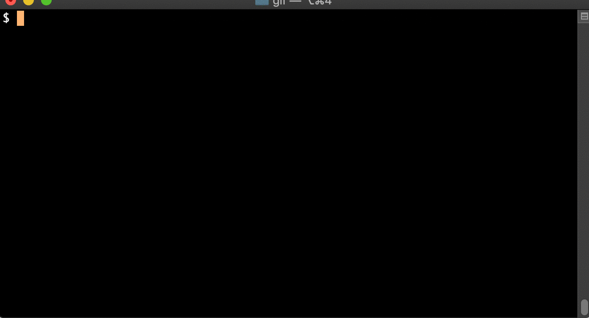

[](https://travis-ci.org/meyermarcel/icm) [](https://goreportcard.com/report/github.com/meyermarcel/icm)

# icm (intermodal container markings)

icm generates or validates single data or whole data sets of intermodal container markings according to [ISO 6346](https://en.wikipedia.org/wiki/ISO_6346).

## Demo



## Documentation

For detailed information and useful examples please read the [docs](docs/icm.md).

## Installation

### macOS

```
brew install meyermarcel/tap/icm
```

### Windows

```
scoop bucket add meyermarcel-bucket https://github.com/meyermarcel/scoop-bucket.git
scoop install icm
```

### Linux

Download your binary in the [Releases](https://github.com/meyermarcel/icm/releases) section.

See the [misc command](docs/icm_misc.md) for **bash/zsh completions** and **manual pages**.

Pull requests to publish automatically to Snapcraft in [Goreleaser](https://goreleaser.com/customization) are welcomed.

## Contributing

1. Fork it

1. Download your fork
    ```
    git clone https://github.com/github_username/icm && cd icm
    ```

1. Create your feature branch
    ```
    git checkout -b my-new-feature
    ```

1. Make changes and add them
    ```
    git add .
    ```

1. Commit your changes
    ```
    git commit -m 'Add some feature'
    ```

1. Push to the branch
    ```
    git push origin my-new-feature
    ```

1. Create new pull request

## Development

1. Requirements
    * [Golang 1.12.x](https://golang.org/doc/install) with Go Modules enabled:
        ```
        export GO111MODULE=on
        ```
    * [GolangCI-Lint 1.16.x](https://github.com/golangci/golangci-lint#install)
    * [GNU Make 4.2.x](https://www.gnu.org/software/make/)

1. To build project execute
    ```
    make
    ```

## Releasing

1. Create version tag according to [SemVer](https://semver.org)
    ```
    git tag "x.y.z"
    ```

1. Push tag and let Travis CI and Goreleaser do the work
+
    ```
    git push --tags
    ```

## License

icm is released under the Apache 2.0 license. See [LICENSE](https://github.com/meyermarcel/icm/blob/master/LICENSE)
